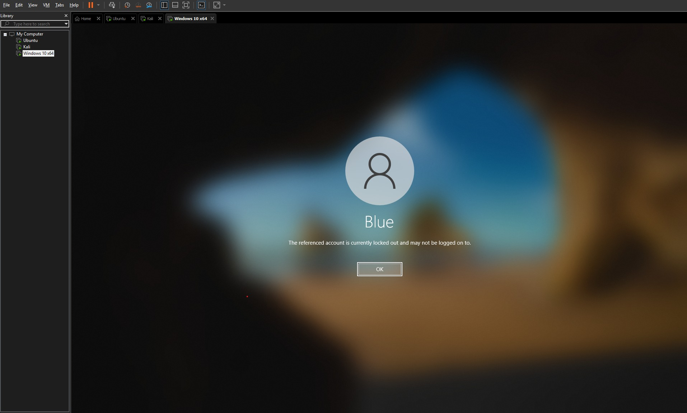
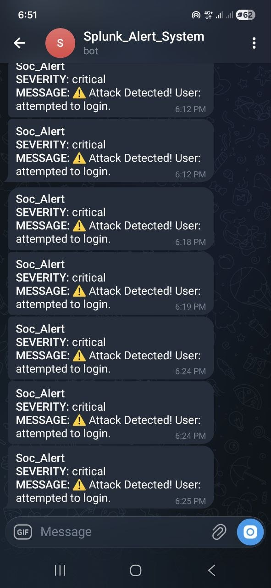
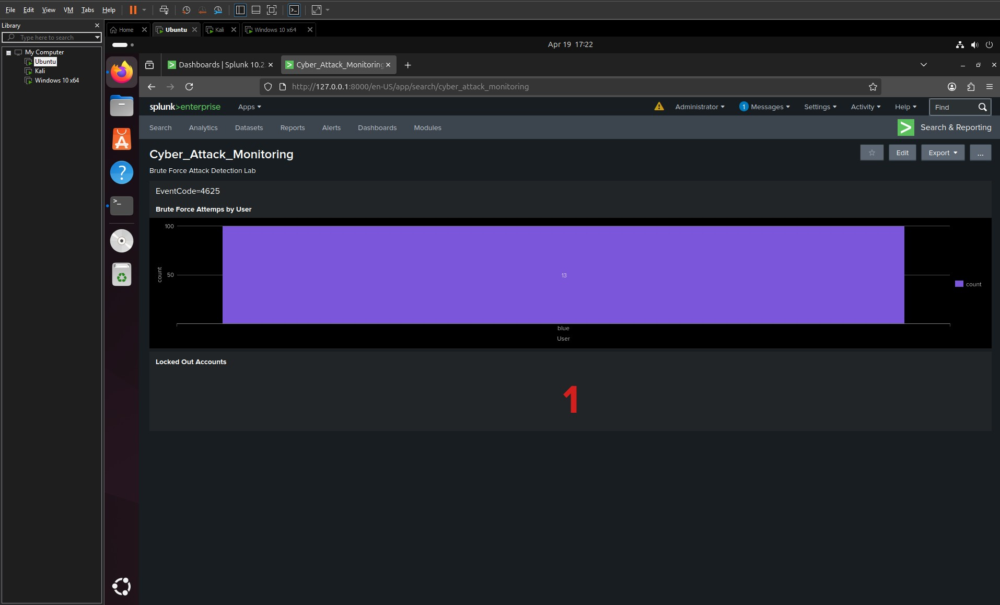

# SOC Automation & Threat Detection Lab

## 🛡️ Project Overview
This project demonstrates the implementation of a **Security Operations Center (SOC)** environment. The lab focuses on detecting, alerting, and responding to **Brute Force attacks** in real-time. It integrates Windows endpoint logging with **Splunk SIEM**, automated alerting via **Telegram API**, and active defense through **Account Lockout Policies**.

## 🏗️ Architecture
- **Attacker**: Kali Linux (Metasploit Framework).
- **Victim**: Windows 10 (Sysmon installed + Splunk Universal Forwarder).
- **SIEM Platform**: Splunk Enterprise on Ubuntu Server.
- **Alerting**: Telegram Bot Integration.

## 🚀 Key Features
- **Real-time Monitoring**: Ingesting Windows Security Event Logs (ID 4625).
- **Advanced Visibility**: Utilizing **Sysmon** for deep process monitoring.
- **Automated Alerting**: Immediate notifications to the SOC Analyst via Telegram.
- **Incident Response**: Automated containment through **Account Lockout Policy** (Event ID 4740).

## 📊 Project Visuals

### 1. Splunk SOC Dashboard
Monitoring failed login attempts and identifying system state changes.


### 2. Telegram Alert Notification
Real-time alerts sent to the analyst's mobile device upon detecting a threat.


### 3. Windows Account Lockout Proof
Evidence of the system automatically neutralizing the attack by locking the targeted account.


## 🔍 Detection Logic (SPL Queries)

### 1. Brute Force Attempt Tracking

This query tracks failed login attempts for a specific user to identify potential brute force activity.
```splunk
index="main" EventCode=4625 Account_Name="blue" | eval User="blue" | stats count by User
```
### 2. Account Lockout Detection
This query monitors Event ID 4740, which indicates a successful automated defense response.
``` index="main" EventCode=4740 | stats count ```

## 🛠️ Incident Response Strategy

The system follows a structured IR (Incident Response) workflow to handle Brute Force attacks:

1. **Detection**: Identifying suspicious patterns of multiple failed login attempts via Splunk using **Event ID 4625**.
2. **Notification**: Utilizing **Telegram Bot API** to send immediate alerts to the SOC Analyst, providing crucial details like the Attacker's IP and the targeted username.
3. **Containment**: Implementing a proactive defense where the Windows system automatically triggers **Event ID 4740 (Account Lockout)** after a set threshold of failed attempts, effectively neutralizing the threat and stopping the attacker from further attempts.

---

## 📝 Author
**Ahmed Shamah** *Fifth-year Informatics Engineering Student | University of Homs*
